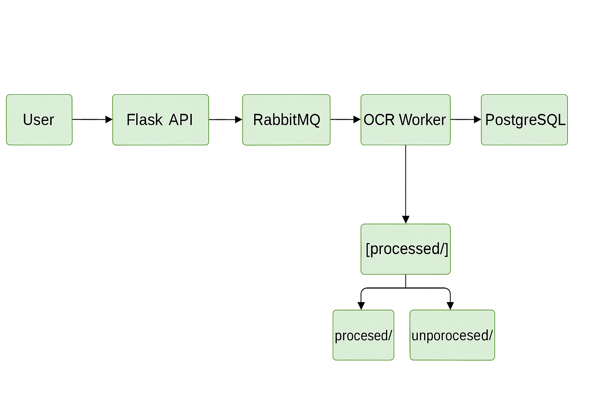

# Invoice OCR Processing Pipeline (Local Simulation)

This project implements a containerized invoice processing pipeline that simulates a real-world, cloud-based system using local open-source tools. It ingests scanned invoice files, extracts key information using OCR (Tesseract), and stores the structured data in a PostgreSQL database. The system uses RabbitMQ as a message queue to decouple the upload and processing components, and Docker Compose to manage service orchestration.

## Project Overview

**Pipeline Flow:**

1. A user uploads a PNG or JPG invoice via a REST API.
2. The file is saved in a designated `inbox/` directory (simulating S3).
3. A message is sent to RabbitMQ, containing the filename.
4. An OCR worker service listens to the queue and processes the invoice using Tesseract OCR.
5. Extracted fields include:
   - Invoice Number  
   - Vendor Name  
   - Date  
   - Total Amount Due  
6. Valid data is stored in a PostgreSQL table, and the file is moved to the `processed/` folder.
7. Files with missing or invalid data are moved to the `unprocessed/` folder for further review.

## System Architecture

- **Flask** – REST API to upload invoice images  
- **RabbitMQ** – Queue to decouple the upload and processing logic  
- **Tesseract OCR** – Text extraction engine  
- **PostgreSQL** – Storage for structured invoice data  
- **Docker & Docker Compose** – Container orchestration  

## Directory Structure

- `inbox/` — Incoming uploaded invoice images  
- `processed/` — Successfully parsed files  
- `unprocessed/` — Files with invalid/missing data  
- `samples/` — Sample invoices for testing  
- `src/` — Application codebase  
- `tests/` — Test scripts  
- `assets/` — Visuals and diagrams  

## Enhancements Beyond Base Requirements

During testing, it became clear that invoices with non-standard formatting or quality issues were being processed incorrectly, resulting in blank or partially filled records in the database. To fix this:

- We added a validation layer to ensure all four key fields (invoice number, vendor, date, and total) are present before saving to the DB.
- If any of these are missing, the file is sent to the `unprocessed/` directory instead of polluting the database.
- This approach was influenced by our own manual testing, where we created purposely malformed images to test robustness.

It was a hands-on solution, evolved from real trial and error.

## Setup Instructions

### Prerequisites

- Docker Desktop (make sure it's running)
- Docker Compose
- Python 3 (for optional test script)

If Docker isn't running, you'll get errors like:  
`error during connect: Get "http://.../images/postgres:14/json"`  
So be sure to start Docker Desktop before continuing.

### Run the System

To start all services:

```bash
docker-compose up --build
```

### Test an Upload

**Option 1: Python test script**

```bash
python tests/test_upload.py
```

This uploads `invoice_1.png` from the `samples/` folder.

> If you want to test with another file, open `tests/test_upload.py` and change this line:

```python
files = {'file': open('samples/your_custom_invoice.png', 'rb')}
```

Just make sure the file exists in the `samples/` directory.

**Option 2: Postman**

- Method: POST  
- URL: `http://localhost:5000/upload`  
- Body: form-data  
- Key: `file`  
- Value: Choose a `.png` or `.jpg` invoice file

### View Stored Records

To check the database contents:

```bash
docker exec -it invoice-ocr-pipeline-postgres-1 psql -U user -d invoices -c "SELECT * FROM invoices;"
```

## Validation Logic

Files are only stored in the database if all of the following fields are successfully extracted:

- Invoice Number  
- Vendor  
- Date  
- Total Amount Due  

Otherwise, they are moved to the `unprocessed/` folder for later review.

## Issues Encountered and Resolved

### Flask Container Kept Exiting

**Symptoms:** It would start and immediately stop.  
**Root Cause:** Missing `app.run()` in `app.py`.  
**Fix:** Added the `app.run()` line and defined a proper command in `docker-compose.yml`.

---

### Uploads Worked, But No Files Showed Up

**Symptoms:** Files weren’t visible in the inbox.  
**Diagnosis:** File types weren’t validated, and Flask wasn’t logging properly.  
**Fix:** We added strict file extension validation and proper error logs. Also sanitized filenames for safety.

---

### Blank or Null Database Entries

**Symptoms:** Empty rows were appearing in PostgreSQL.  
**Diagnosis:** Tesseract sometimes failed to read fields, but we were still inserting into the DB.  
**Fix:** Added a `is_valid()` check before any insert. Missing or malformed files are now routed to the `unprocessed/` directory.

---

### OCR Couldn't Read Stylized Fonts

**Symptoms:** OCR misread “Invoice” as “1nv0ic3” or “Date” as “Datz”.  
**Fix:** We introduced a variety of broken test files deliberately to simulate this, and the `unprocessed/` folder became our way of filtering them out cleanly.

---

### Files “Disappeared” After Upload

**Symptoms:** Upload appeared successful, but file wasn’t found.  
**Diagnosis:** The OCR worker processed and moved it to `processed/` before we could blink.  
**Fix:** Not really a fix, but improved logging helped clarify that everything was working as expected.

---

## Testing Summary

We tested:

- REST API file upload
- OCR parsing of fields
- DB insertion validation
- Handling of malformed invoices
- Folder transitions between inbox, processed, and unprocessed

## Potential Enhancements

- Add image preprocessing for OCR accuracy (thresholding, denoise)
- Support for multipage Images invoices
- UI for uploading and reviewing invoice status
- Email or Slack notifications for files routed to `unprocessed/`
- Add user authentication and token-based upload support

### System Diagram

The following image shows how each service connects and communicates:



User
 │
 ▼
Flask API (/upload)
 │
 ▼
RabbitMQ Queue (invoice_queue)
 │
 ▼
OCR Worker
 ├── Tesseract OCR
 ├── Field Validation
 └── PostgreSQL + Folder Routing


## Conclusion

This project started with a simple idea and evolved into something far more production-conscious. We didn’t just throw code at the wall and hope it stuck — we broke things, patched them up, made things weird on purpose, and made sure the system stayed solid through it all. The `unprocessed/` logic didn’t exist when we started, but became a key component through iterative testing and validation.

The result? A pipeline that’s fast, modular, and (relatively) foolproof.

