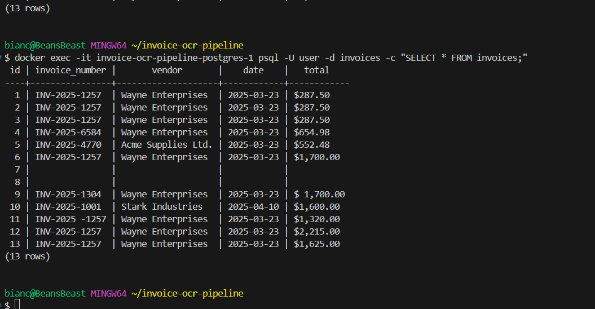

# Developer Log: Trials, Errors & Evolution of the Invoice OCR Pipeline

As with most real-world builds, this one wasn't all sunshine and clean builds. It was a journey of misfires, blank rows, broken queues, and those sneaky images that refused to play nice with OCR. This document serves as a reflective breakdown of the key challenges we faced — and the pragmatic (sometimes duct-taped) decisions made to overcome them.

---

## Issue #1: Flask Container Kept Exiting

**Symptoms:**  
Container spun up and… disappeared instantly.

**Diagnosis:**  
Turns out, the `app.py` file was missing the `app.run()` clause. Classic beginner blunder — without it, Flask never enters a run loop, so Docker thought it did its job and bailed.

**Fix:**  
Added `app.run(host='0.0.0.0', port=5000, debug=True)` and set the command explicitly in `docker-compose.yml`.

**Lesson:**  
Always check for that Flask entrypoint, and always explicitly define container commands when debugging.

---

## Issue #2: The Phantom Upload

**Symptoms:**  
Files were being “uploaded” from Postman… but nothing showed in the inbox folder. Not even a log entry.

**Diagnosis:**  
At first, it looked like a volume issue. After triple-checking the mounts in Docker Compose, we realized we weren’t validating file types and missing error messages from the Flask endpoint.

**Fix:**  
- Added file type validation.
- Added secure filename handling with `werkzeug.utils.secure_filename()`.
- And started logging all the errors properly.

**Lesson:**  
Don't assume file uploads succeed unless you explicitly check every single step — and log generously.

---

## Issue #3: OCR Insertion Creates Empty DB Entries

**Symptoms:**  
Rows in the PostgreSQL table with `NULL` or empty `invoice_number`, `vendor`, `total`, etc.

**Diagnosis:**  
Our OCR logic extracted text — but we didn't validate if the fields were actually populated before inserting into the DB. Tesseract was returning junk or blanks for noisy or malformed invoices.

**Fix:**  
We introduced an `is_valid()` function to ensure all required fields are populated before allowing DB insertion.

**Bonus Decision:**  
To prevent data pollution and support auditability, we created a dedicated `unprocessed/` directory. Any file that fails validation is moved there instead of being processed or silently discarded.

**Lesson:**  
Data quality over quantity. Don't insert if you're not confident in the input.

---

## Issue #4: Tesseract Doesn’t Like Some Fonts

**Symptoms:**  
OCR was doing its thing… poorly. We were getting “1nv0ic3: INV-l2O5-AB3” and dates like “Datz: z025-0B-17”.

**Diagnosis:**  
The test invoices had stylized fonts, scanned noise, and even spacing irregularities. Tesseract just couldn't parse them well.

**Fix:**  
We introduced our own set of broken/malformed test images — on purpose — and validated our fallback logic (unprocessed routing) handled it correctly.

**Lesson:**  
Don't test with only clean data. Break your system on purpose.

---

## Issue #5: Test Images Not Reflected in Inbox

**Symptoms:**  
Post-upload, files weren’t visible. Yet Flask returned success.

**Diagnosis:**  
They were getting processed so fast, the OCR worker already consumed and moved them to `processed/` before we could even check the folder.

**Fix:**  
N/A — this was expected behavior once understood. But it taught us the importance of clearly labeling logs and folder movement.

---

## Bonus Feature: PDF Support (Totally by Accident... But We Kept It!)

**Background:**  
The original challenge asked for PNG and JPG support only. However, during early development, PDF parsing logic was added to experiment with OCR quality. This worked so well that it was left in.

**Fix (or rather, Feature):**  
We added `pdf2image` support and use it to extract images from PDF pages. If a `.pdf` is uploaded, it's processed just like an image.

**Why We Kept It:**  
- It works without breaking anything.
- It adds flexibility for future users.
- It was done anyway — might as well polish and ship it.

**Lesson:**  
Sometimes you accidentally build a feature. Own it.

---

## Final Thoughts

This project evolved beyond a simple coding exercise. We tried (and failed) at a few things, learned the hard way, and made the system more resilient along the way. Adding the `unprocessed/` logic and keeping PDF support were decisions born of testing, observation, and a dash of developer curiosity.

---

**Pro Tip for Reviewers:** If you're reading this, take a peek at the `unprocessed/` folder after test runs. That's where the fun (aka broken) cases go.
